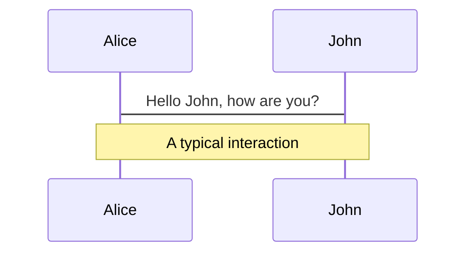
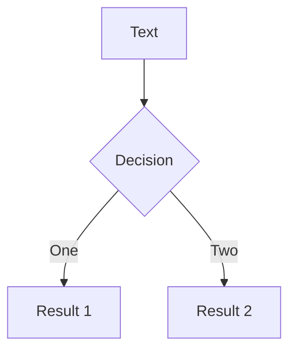

---
# try also 'default' to start simple
theme: seriph
# random image from a curated Unsplash collection by Anthony
# like them? see https://unsplash.com/collections/94734566/slidev
background: https://overwatch.nosdn.127.net/1/assets/img/pages/community/heroes-among-us/header-tablet.jpg
# apply any windi css classes to the current slide
class: 'text-center'
# https://sli.dev/custom/highlighters.html
highlighter: shiki
# show line numbers in code blocks
lineNumbers: false
# some information about the slides, markdown enabled
info: |
  ## Slidev Starter Template
  Presentation slides for developers.

  Learn more at [Sli.dev](https://sli.dev)
---

# 守望先锋 ECS 架构浅析

面向数据的编程模式

<!--
The last comment block of each slide will be treated as slide notes. It will be visible and editable in Presenter Mode along with the slide. [Read more in the docs](https://sli.dev/guide/syntax.html#notes)
-->

---

# 什么是 E.C.S 架构?

Entity Component System

- 📝 **Component**组件 - 其实就是数据，不包含任何内部方法
- 🎨 **System**系统 - 纯粹的方法，不包含任何的私有 Field
- 🧑‍💻 **Entity**实体 - 一个标识，通常是 id

<br>
<br>

Read more about [Why Slidev?](https://sli.dev/guide/why)

<!--
You can have `style` tag in markdown to override the style for the current page.
Learn more: https://sli.dev/guide/syntax#embedded-styles
-->

<style>
h1 {
  background-color: #2B90B6;
  background-image: linear-gradient(45deg, #4EC5D4 10%, #146b8c 20%);
  background-size: 100%;
  -webkit-background-clip: text;
  -moz-background-clip: text;
  -webkit-text-fill-color: transparent; 
  -moz-text-fill-color: transparent;
}
</style>

---

# 面向数据编程实例

Hover on the bottom-left corner to see the navigation's controls panel, [learn more](https://sli.dev/guide/navigation.html)

---

# UI = F(State)

|     |     |
| --- | --- |
| <kbd>right</kbd> / <kbd>space</kbd>| next animation or slide |
| <kbd>left</kbd>  / <kbd>shift</kbd><kbd>space</kbd> | previous animation or slide |
| <kbd>up</kbd> | previous slide |
| <kbd>down</kbd> | next slide |

<!-- https://sli.dev/guide/animations.html#click-animations -->

<p v-after class="absolute bottom-23 left-45 opacity-30 transform -rotate-10">Here!</p>

---

# 为什么不用面向对象的设计

1. **过度封装** 会把一些复杂的问题分拆抽象成较简单的独立对象，通过对象的互相调用去实现方案，一个问题的数据集会被分散在不同的内存区域。
2. **多态** 虚函数表是通过加入一次间接层来实现动态派送。但在调用的时候需要读取虚函数表，增加 cache miss 的可能性。
3. **数据布局** 解决一个问题可能只需要很少的成员变量，但仍把整个对象载入缓存。[^1] [^2]


```c
struct Particle {
  Vector3 position;
  Vector4 velocity;
  Vector4 color;
  fload age;
  // ...
}
```
<h1 style="color: #e9e56f" v-click>继承不足以描述关系建模</h1>

[^1]: [面向对象编程的弊端是什么？](https://zhuanlan.zhihu.com/p/92345645)

[^2]: [为什么面向对象糟透了？](https://www.zhihu.com/question/20275578/answer/27046327)

<style>
.footnotes-sep {
  @apply opacity-10;
}
.footnotes {
  @apply text-sm opacity-75;
}
.footnote-backref {
  display: none;
}
</style>

---
layout: image-right
image: https://overwatch.nosdn.127.net/a/images/2020/3/19/0dbd2928584ecb92961b6432863114a0.png
---

# ECS 的优缺点

<ul>
<li class="ghost-good">数据由World统一管理，使用连续的内存布局，提升 CPU Cache 命中率</li>
<li class="ghost-good">一个 System 并不同时操作所有 Component，可以多核与并行计算</li>
<li class="ghost-good">擅长处理多模型场景</li>
</ul>
<br>
<br>
<ul>
<li class="ghost-bad">新的心智模型，可读性不如面向对象的程序设计</li>
<li class="ghost-bad">从已有项目迁移困难</li>
</ul>

<style>
li::marker {
    unicode-bidi: isolate;
    font-variant-numeric: tabular-nums;
    text-transform: none;
    text-indent: 0px !important;
    text-align: start !important;
    text-align-last: start !important;
}
li {
  position: relative;
}
.ghost-good {
  color: #47d58a;
}
.ghost-good::before, .ghost-bad::before {
  content: "";
  position: absolute;
  display: inline-block;
  width: 30px;
  height: 30px;
  left: -30px;
  background-repeat: no-repeat;
  background-size: contain;
}
.ghost-good::before {
  background-image: url(https://aph.dodo.me/slides/ghost_upside.af01f1ab.png);
}
.ghost-bad {
  color: #ff867f;
}
.ghost-bad::before {
  background-image: url(https://aph.dodo.me/slides/ghost_downside.40a6de8f.png);
}
</style>

---

# 谁在使用 ECS

框架|简介|适用语言|网站
--|--|--|--
**Entitas** | Unity 社区插件 | `C#` | [Github Repo](https://github.com/sschmid/Entitas-CSharp)
**Bevy** | 独立游戏引擎 | `Rust` | [Site](https://bevyengine.org/)
**ECSY** | Mozilla Mixed Reality 团队开源 | `JS` | [Document](https://ecsy.io/docs)
**Eva.js** | 淘系互动前端团队 | `JS` | [官网](https://eva-engine.gitee.io/#/)


---
class: px-20
---

# Snake Demo Code

Slidev comes with powerful theming support. Themes can provide styles, layouts, components, or even configurations for tools. Switching between themes by just **one edit** in your frontmatter:

<div grid="~ cols-2 gap-2" m="-t-2">

```yaml
---
theme: default
---
```

```yaml
---
theme: seriph
---
```


</div>

Read more about [How to use a theme](https://sli.dev/themes/use.html) and
check out the [Awesome Themes Gallery](https://sli.dev/themes/gallery.html).

---
preload: false
---

# 对于实际项目的作用

Animations are powered by [@vueuse/motion](https://motion.vueuse.org/).

```html
<div
  v-motion
  :initial="{ x: -80 }"
  :enter="{ x: 0 }">
  Slidev
</div>
```

<div class="w-60 relative mt-6">
  <div class="relative w-40 h-40">
    
    
    
  </div>

  <div 
    class="text-5xl absolute top-14 left-40 text-[#2B90B6] -z-1"
    v-motion
    :initial="{ x: -80, opacity: 0}"
    :enter="{ x: 0, opacity: 1, transition: { delay: 2000, duration: 1000 } }">
    Slidev
  </div>
</div>

<!-- vue script setup scripts can be directly used in markdown, and will only affects current page -->
<script setup lang="ts">
const final = {
  x: 0,
  y: 0,
  rotate: 0,
  scale: 1,
  transition: {
    type: 'spring',
    damping: 10,
    stiffness: 20,
    mass: 2
  }
}
</script>

<div
  v-motion
  :initial="{ x:35, y: 40, opacity: 0}"
  :enter="{ y: 0, opacity: 1, transition: { delay: 3500 } }">

[Learn More](https://sli.dev/guide/animations.html#motion)

</div>

---

# 参考

LaTeX is supported out-of-box powered by [KaTeX](https://katex.org/).

<br>

Inline $\sqrt{3x-1}+(1+x)^2$

Block
$$
\begin{array}{c}

\nabla \times \vec{\mathbf{B}} -\, \frac1c\, \frac{\partial\vec{\mathbf{E}}}{\partial t} &
= \frac{4\pi}{c}\vec{\mathbf{j}}    \nabla \cdot \vec{\mathbf{E}} & = 4 \pi \rho \\

\nabla \times \vec{\mathbf{E}}\, +\, \frac1c\, \frac{\partial\vec{\mathbf{B}}}{\partial t} & = \vec{\mathbf{0}} \\

\nabla \cdot \vec{\mathbf{B}} & = 0

\end{array}
$$

<br>

[Learn more](https://sli.dev/guide/syntax#latex)

---

# Diagrams

You can create diagrams / graphs from textual descriptions, directly in your Markdown.

<div class="grid grid-cols-2 gap-10 pt-4 -mb-6">





</div>

[Learn More](https://sli.dev/guide/syntax.html#diagrams)


---
layout: center
class: text-center
---

# Learn More

[Documentations](https://sli.dev) · [GitHub](https://github.com/slidevjs/slidev) · [Showcases](https://sli.dev/showcases.html)
