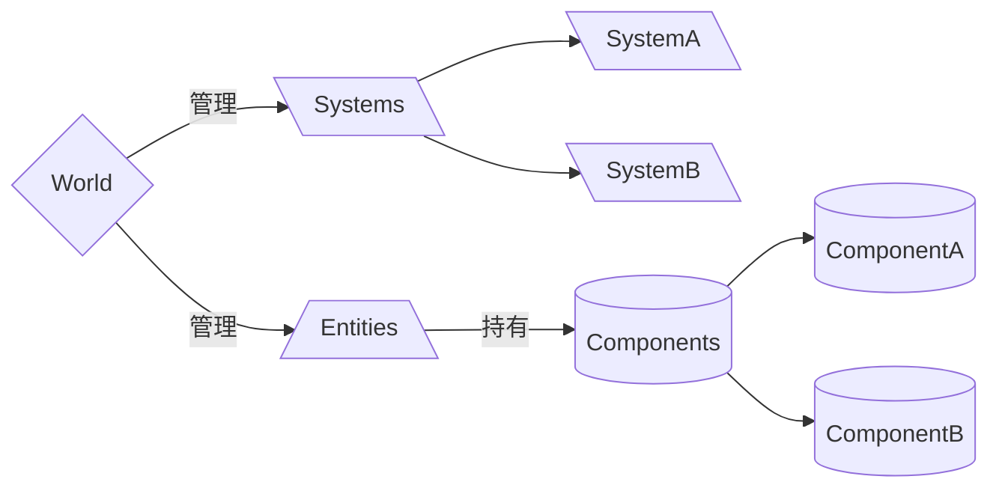
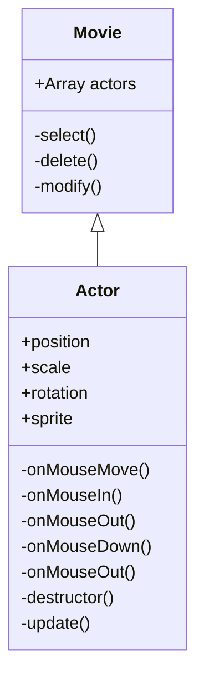
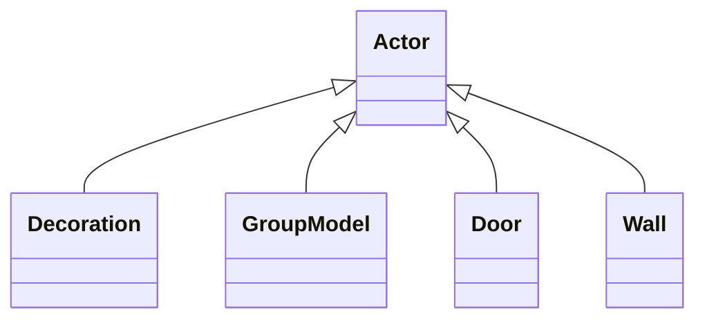
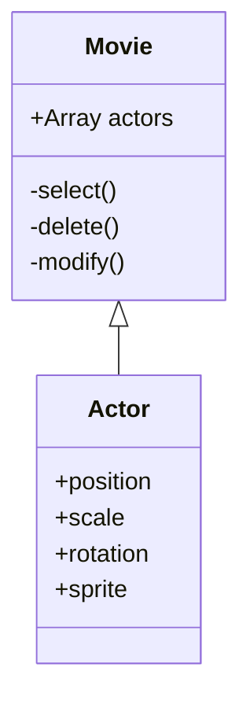
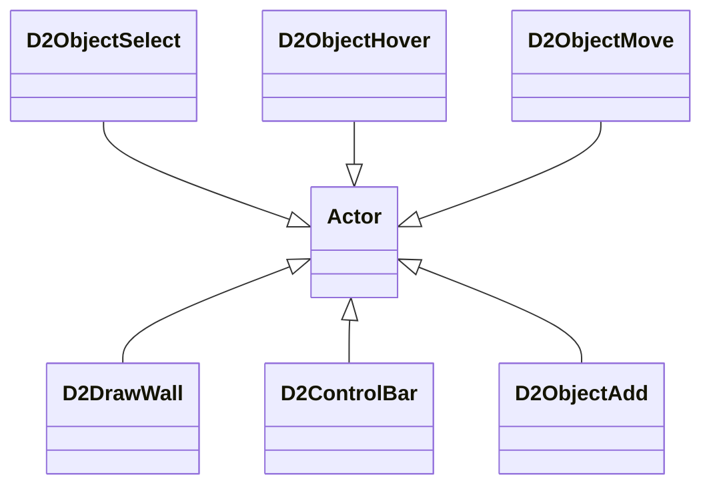

---
# try also 'default' to start simple
theme: seriph
# random image from a curated Unsplash collection by Anthony
# like them? see https://unsplash.com/collections/94734566/slidev
background: /OverWatch.jpg
# apply any windi css classes to the current slide
class: 'text-center'
# https://sli.dev/custom/highlighters.html
highlighter: shiki
# show line numbers in code blocks
lineNumbers: false
# some information about the slides, markdown enabled
---

# 守望先锋 ECS 架构浅析

面向数据的编程模式

<!--
The last comment block of each slide will be treated as slide notes. It will be visible and editable in Presenter Mode along with the slide. [Read more in the docs](https://sli.dev/guide/syntax.html#notes)
-->

---

# 什么是 E.C.S 架构?

Entity Component System

- 🧑 **Entity** (实体) - 一个标识，通常是 id ，可挂载上多个 Component
- 📝 **Component** (组件) - 其实就是数据，附着在 Entity 上，不包含任何内部方法
- 🎨 **System** (系统) - 纯粹的方法，不包含任何的私有 Field。修改 Component，处理 Entity
- 🧮 **Query** - 系统用于过滤它需要的组件和实体
- 🛠 **World** - 管理以上所有

<br>



<!--
You can have `style` tag in markdown to override the style for the current page.
Learn more: https://sli.dev/guide/syntax#embedded-styles
-->

<style>
h1 {
  background-color: #2B90B6;
  background-image: linear-gradient(45deg, #4EC5D4 10%, #146b8c 20%);
  background-size: 100%;
  -webkit-background-clip: text;
  -moz-background-clip: text;
  -webkit-text-fill-color: transparent; 
  -moz-text-fill-color: transparent;
}
</style>

---

<!-- # GDC [^1] 视频截图 (1) -->


[^1]: [Game Developer Conference](https://www.youtube.com/watch?v=W3aieHjyNvw&t=1501s)

---

<!-- # GDC 视频截图 (2) -->


---

<!-- # GDC 视频截图 (3) -->


---

<!-- # GDC 视频截图 (4) -->


---

# 为什么不用面向对象的设计

1. **过度封装** 会把一些复杂的问题分拆抽象成较简单的独立对象，通过对象的互相调用去实现方案，一个问题的数据集会被分散在不同的内存区域。
2. **多态** 虚函数表是通过加入一次间接层来实现动态派送。但在调用的时候需要读取虚函数表，增加 cache miss 的可能性。
3. **数据布局** 解决一个问题可能只需要很少的成员变量，但仍把整个对象载入缓存。[^1] [^2]


```c
struct Particle {
  Vector3 position;
  Vector4 velocity;
  Vector4 color;
  fload age;
  // ...
}
```
<h1 style="color: orange" v-click>继承不足以描述关系建模</h1>

[^1]: [面向对象编程的弊端是什么？](https://zhuanlan.zhihu.com/p/92345645)

[^2]: [为什么面向对象糟透了？](https://www.zhihu.com/question/20275578/answer/27046327)

<style>
.footnotes-sep {
  @apply opacity-10;
}
.footnotes {
  @apply text-sm opacity-75;
}
.footnote-backref {
  display: none;
}
</style>

<!-- 
1. 使用OOP时，会把一些复杂的问题分拆抽象成较简单的独立对象，通过对象的互相调用去实现方案。但是，由于对象包含自己封装的数据，一个问题的数据集会被分散在不同的内存区域。互相调用时很可能会出现数据的cache miss的情况。

2.在C++的一般的多态实现中，会使用到虚函数表。虚函数表是通过加入一次间接层来实现动态派送。但在调用的时候需要读取虚函数表，增加cache miss的可能性。基本上要支持动态派送，无论用虚函数表、函数指针都会形成这个问题，但如果类的数目极多，把函数指针如果和数据放在一起有时候可放缓问题。

3. 虽然OOP本身并无限制数据的布局方式，但基本上绝大部分OOP语言都是把成员变量连续包裹在一段内存中。甚至使用C去编程的时候，也通常会使用到OOP或Object-based的思考方式，把一些相关的数据放置于一个struct之内 -->
---
layout: image-right
image: /Echo.png
---

# ECS 的优缺点

<ul>
<li class="ghost-good">数据由World统一管理，使用连续的内存布局，提升 CPU Cache 命中率</li>
<li class="ghost-good">一个 System 并不同时操作所有 Component，可以多核与并行计算</li>
<li class="ghost-good">擅长处理多模型场景</li>
</ul>
<br>
<br>
<ul>
<li class="ghost-bad">新的心智模型，可读性不如面向对象的程序设计</li>
<li class="ghost-bad">不擅长构建一般的UI</li>
</ul>

<hr/>

<ul v-click>
  <li><strong>面向对象</strong>我是什么---我是子弹对象，我是炸弹对象</li>
  <li><strong>面向数据</strong>我有什么---我有移动组件，我有爆炸组件</li>
</ul>

<style>
li::marker {
    unicode-bidi: isolate;
    font-variant-numeric: tabular-nums;
    text-transform: none;
    text-indent: 0px !important;
    text-align: start !important;
    text-align-last: start !important;
}
li {
  position: relative;
}
.ghost-good {
  color: #47d58a;
}
.ghost-good::before, .ghost-bad::before {
  content: "";
  position: absolute;
  display: inline-block;
  width: 30px;
  height: 30px;
  left: -30px;
  background-repeat: no-repeat;
  background-size: contain;
}
.ghost-good::before {
  background-image: url(https://aph.dodo.me/slides/ghost_upside.af01f1ab.png);
}
.ghost-bad {
  color: #ff867f;
}
.ghost-bad::before {
  background-image: url(https://aph.dodo.me/slides/ghost_downside.40a6de8f.png);
}
</style>

---

# 谁在使用 ECS

框架|简介|适用语言|网站
--|--|--|--
**Entitas** | Unity 社区插件 | `C#` | [Github Repo](https://github.com/sschmid/Entitas-CSharp)
**Bevy** | 独立游戏引擎 | `Rust` | [Site](https://bevyengine.org/)
**ECSY** | Mozilla Mixed Reality 团队开源 | `JS` | [Document](https://ecsy.io/docs)
**Eva.js** | 淘系互动前端团队 | `JS` | [官网](https://eva-engine.gitee.io/#/)


---
class: px-20
---

# Demo Code

- bevy_snake [https://github.com/marcusbuffett/bevy_snake](https://github.com/marcusbuffett/bevy_snake)
- ecsy-three 官方仓库 [https://github.com/ecsyjs/ecsy-three](https://github.com/ecsyjs/ecsy-three)

---
layout: two-cols
---

- 之前设计工具 2D 架构


::right::

- 不同的模型继承自Actor

---
layout: two-cols
---

- 当前设计工具 2D 架构


::right::

- actor 内部方法几乎弃用，由不同的外部类来管理 actor 内部数据


---
layout: two-cols
---


::default::
# 待解决的问题
<ul>
  <li class="ghost-bad">2/3D渲染不同步</li>
  <li class="ghost-bad">2/3D功能不同步</li>
</ul>
::right::

# 解决方案
<ul>
  <li class="ghost-good">不再把2D、3D当作独立的对象，而是同一个 Word 下不同的 System</li>
  <li class="ghost-good">逻辑交给其他 System，2/3D 只负责忠实地渲染</li>
</ul>

<style>
li::marker {
    unicode-bidi: isolate;
    font-variant-numeric: tabular-nums;
    text-transform: none;
    text-indent: 0px !important;
    text-align: start !important;
    text-align-last: start !important;
}
li {
  position: relative;
}
.ghost-good {
  color: #47d58a;
}
.ghost-good::before, .ghost-bad::before {
  content: "";
  position: absolute;
  display: inline-block;
  width: 30px;
  height: 30px;
  left: -30px;
  background-repeat: no-repeat;
  background-size: contain;
}
.ghost-good::before {
  background-image: url(https://aph.dodo.me/slides/ghost_upside.af01f1ab.png);
}
.ghost-bad {
  color: #ff867f;
}
.ghost-bad::before {
  background-image: url(https://aph.dodo.me/slides/ghost_downside.40a6de8f.png);
}
</style>


---
layout: center
---
# 谢谢观赏

---

# 简单的例子

张鑫旭 [js面向数据编程(DOP)一点分享](https://www.zhangxinxu.com/wordpress/2011/01/js%e9%9d%a2%e5%90%91%e6%95%b0%e6%8d%ae%e7%bc%96%e7%a8%8bdop%e4%b8%80%e7%82%b9%e5%88%86%e4%ba%ab/?shrink=1)

---

# UI = Func( State )
